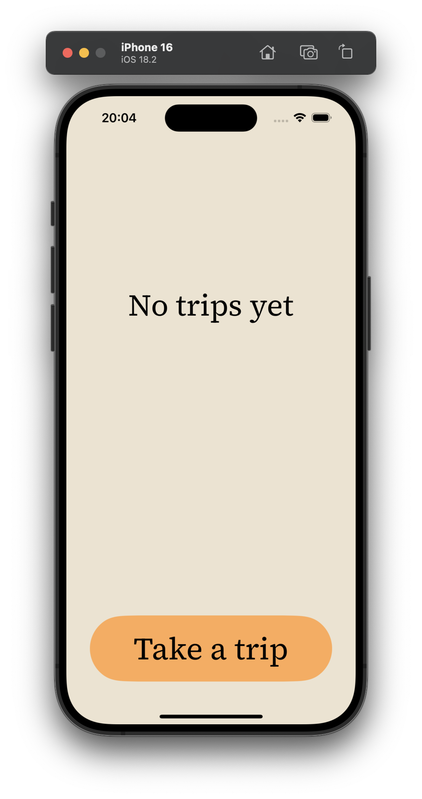
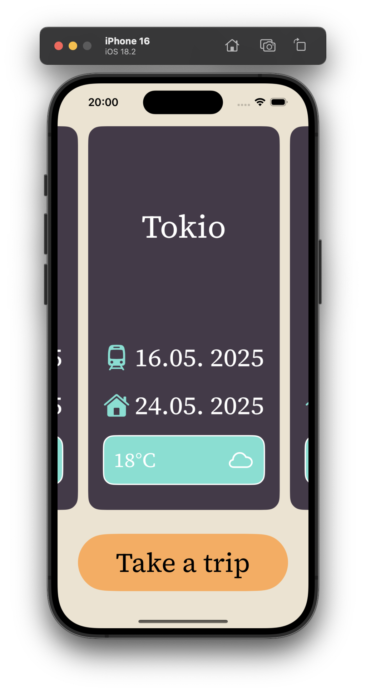
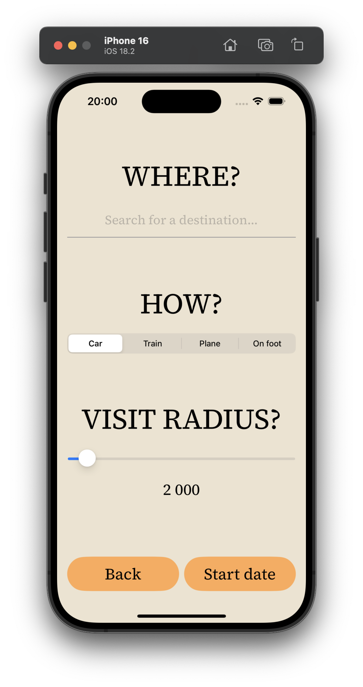
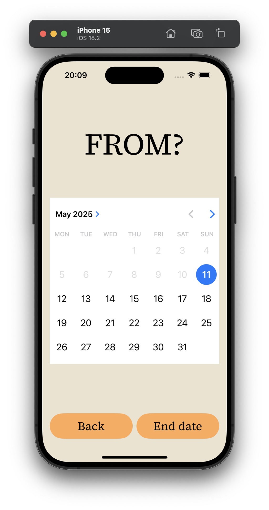
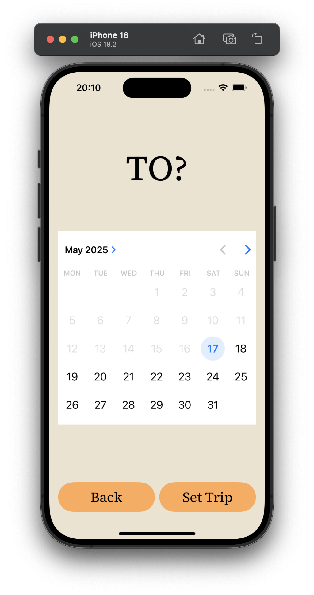
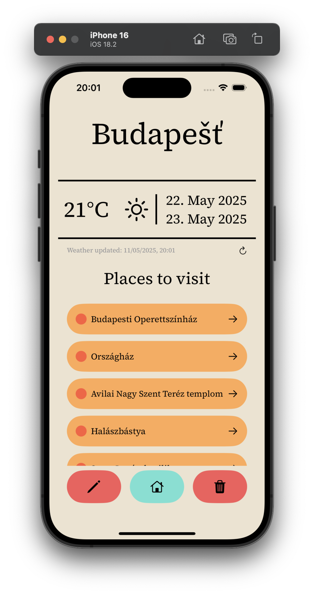
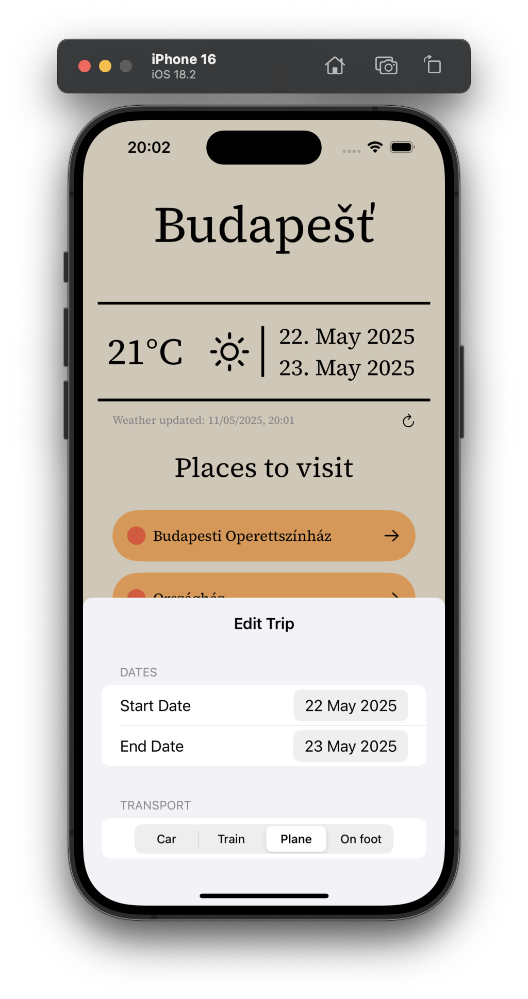

# Tripity
* This product is final project for IZA at Faculty of Information Technology Brno University of Technology
* **Author**: Samuel Kundrát
* **Language**: Swift
* **API used**: geoapify, OpenWeatherMap

### Description
Tripity is a lightweight iOS travel planning app built using SwiftUI, SwiftData, and Combine. It allows users to create and manage trips by selecting destinations, travel dates, and transportation modes. The app automatically fetches weather data for the selected location and dates using OpenWeatherMap's API. App includes deature for places to visit suggestions with geoapify.com API.

#### Features
* Create and edit trips with start/end dates and transport options

* Automatic weather fetching for trip dates and destination

* Places to visit suggestions

* SwiftData-powered offline data storage

* Modular architecture using MVVM + Combine

# Usage
[ Take a trip ] -> [Trip information](#trip-info)

[ Start date] -> [Trip start date](#date-from)

[ End date] -> [Trip end date](#date-to)

[ Set trip ] -> [Trip detail](#trip-detail)

[ Edit ] -> [Edit trip](#trip-edit)

[ Home ] -> [Trips overview](#main-screen-with-trips)

[ Delete ] -> [Trips overview](#main-screen-with-trips)

click on trip card -> [Trip detail](#trip-detail)
# App

## Main Screen With no Trips

##  Main Screen With Trips

## Trip Creation
### Trip info

### Date from

### Date to

## Trip Detail

## Trip Edit

### Credits
name by : Mario Horvath
